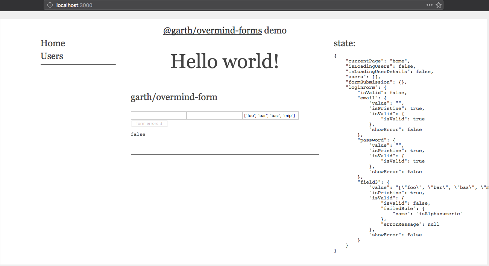

# overmind.js `overmind-forms-example` demo

for overmind v15.1.2 & react v16.8.1 using @garth's `overmind-forms` package

this repo: https://github.com/100ideas/overmind-forms-demo/

[codesandbox demo](https://codesandbox.io/s/github/100ideas/overmind-forms-example/tree/codesandbox_v1)




**Note:** you may need to use a patched version of `overmind-forms` - see below

`overmind-forms` documentation here: https://github.com/garth/overmind-forms

**Related/better**: https://github.com/garth/state-forms. I integrated some of the validation code from `state-forms` into the `src/overmind/login` form code for this demo. It would probably be better to just adapt state-forms to overmind since it looks like its used more broadly.

---

## 21 Feb 2019 patch notes (@100ideas)

this folder is a fork of source code of the overmind-forms node package with small patch.
- original: https://github.com/garth/overmind-forms
- patch: https://github.com/100ideas/overmind-forms
- demo repo: https://github.com/100ideas/overmind-forms-demo/ (see codesandbox_v1 branch)
- [codesandbox demo](https://codesandbox.io/s/github/100ideas/overmind-forms-example/tree/codesandbox_v1)

had to merge `hack` branch into `master` branch of my fork of `overmind-forms` since codesandbox can't handle references to node packages on github that include a branch or commit, ie:

```json
// in package.json
  "dependencies": {                                       // what happens on codesandbox?
    "overmind-forms": "100ideas/overmind-forms#hack",     // fail - desired branch
    "overmind-forms": "100ideas/overmind-forms#70fdc88",  // fail - commit-ish of hack 
    "overmind-forms": "100ideas/overmind-forms",          // works - but is master branch
```

I also noticed codesandbox having trouble compiling the typescript source of the package on install (since this demo repo is a js create-react-app template and somewhere or other not all the right ts / babel deps are getting specified). 

So over in my fork of `overmind-forms`, I un-gitignored the built directories (`es/`, `lib/`), added them to the repo, and disabled the build directives triggered by the `prepare` script in the packages' `package.json`. That worked for codesandbox.

#### alternative solution

didn't end up doing this because would require manually syncing patch directory with changes to fork repo, but it works

```shell
$ tree -L 1 .
.
├── overmind-forms/
└── overmind-forms-example/

$ cd overmind-forms-example
$ mkdir patch
$ cp -r overmind-forms patch/
```

```json
// package.json
//...
"dependencies": {
    "overmind": "15.1.2",
    "overmind-react": "16.1.3",
    // "overmind-forms": "100ideas/overmind-forms",
    //...
  },
  "peerDependencies": {
    "overmind-forms": "100ideas/overmind-forms#hack",
  },
  "scripts": {
    "postinstall": "cp -r patch/overmind-forms node_modules/",
    // ...
```

## 20 Feb 2019 patch notes (@100ideas)

see https://github.com/100ideas/overmind-forms for details of patch and instructions for developing locally.

in case of problems on codesandbox, try the `codesandbox_v1` branch, hopefully it still works over there. https://github.com/100ideas/overmind-forms-demo/tree/codesandbox_v1

---
